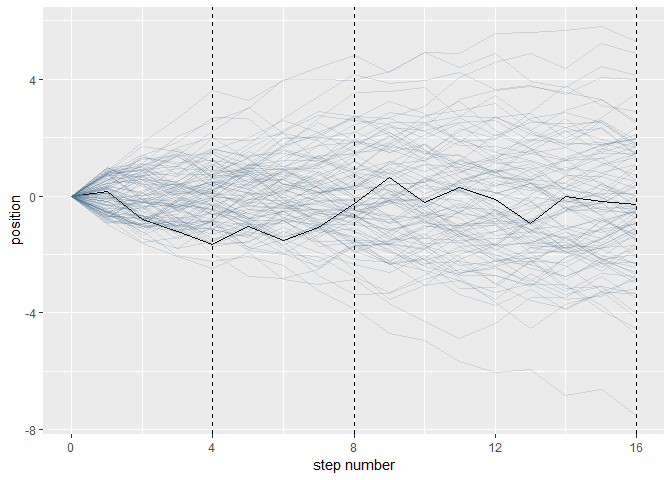

Chapter 4
================
Christopher Chan
11:01 21 May 2019

``` r
library(tidyverse)
library(brms)
```

### 4.1

``` r
set.seed(4)

pos <- 
  replicate(100, runif(16, -1, 1)) %>%
  as_tibble() %>%
  rbind(0, .) %>%
  mutate(step = 0:16) %>%
  gather(key, value, -step) %>%
  mutate(person = rep(1:100, each = 17)) %>%
  group_by(person) %>%
  mutate(position = cumsum(value)) %>%
  ungroup()
```

    ## Warning: `as_tibble.matrix()` requires a matrix with column names or a `.name_repair` argument. Using compatibility `.name_repair`.
    ## This warning is displayed once per session.

``` r
glimpse(pos)
```

    ## Observations: 1,700
    ## Variables: 5
    ## $ step     <int> 0, 1, 2, 3, 4, 5, 6, 7, 8, 9, 10, 11, 12, 13, 14, 15,...
    ## $ key      <chr> "V1", "V1", "V1", "V1", "V1", "V1", "V1", "V1", "V1",...
    ## $ value    <dbl> 0.00000000, 0.17160061, -0.98210841, -0.41252078, -0....
    ## $ person   <int> 1, 1, 1, 1, 1, 1, 1, 1, 1, 1, 1, 1, 1, 1, 1, 1, 1, 2,...
    ## $ position <dbl> 0.00000000, 0.17160061, -0.81050780, -1.22302857, -1....

``` r
ggplot(pos, aes(step, position, group=person)) +
  geom_line(aes(color = person < 2, alpha = person < 2)) + 
  geom_vline(xintercept = c(4, 8, 16), linetype = 2) +
  scale_color_manual(values = c("skyblue4", "black")) +
  scale_alpha_manual(values = c(1/5, 1)) +
  scale_x_continuous("step number", breaks = c(0, 4, 8, 12, 16)) +
  theme(legend.position = "none")
```



### 4.2

### 4.3

-   Define distributions by *μ* and *σ* and rank by plausibility, aka our posterior plausibility.

``` r
df <- read_delim('data/Howell1.csv', delim = ';')
```

    ## Parsed with column specification:
    ## cols(
    ##   height = col_double(),
    ##   weight = col_double(),
    ##   age = col_double(),
    ##   male = col_double()
    ## )
